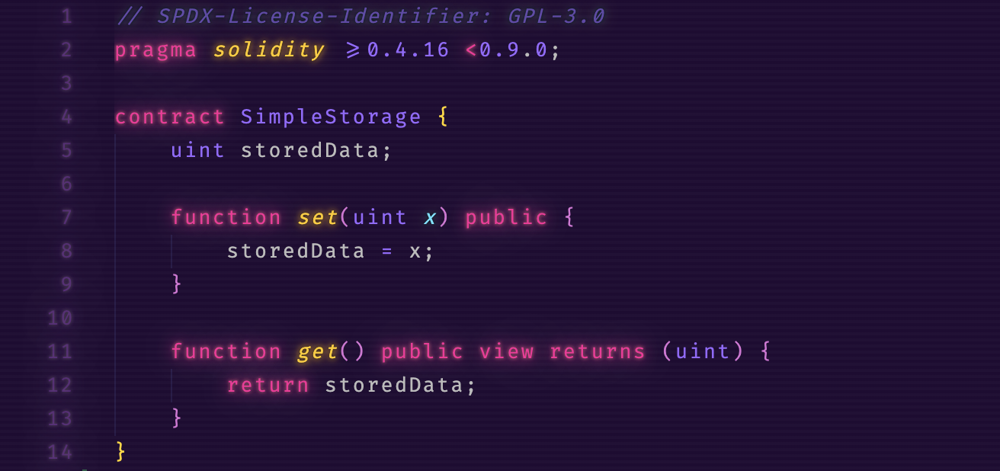

# Ξ VS Code Theme
```JavaScript
/*
* @title Ξ
* @author zkJΞT
* @description ΞTH VSCode Theme
* Twitter - @zkjet 
*/

// After a few hackathons being asked what 
// vscode theme I was using, I decided to 
// make it official, fork my favorite one, 
// synthwave-x-fluoromachine and customize it fully. https://github.com/webrender/synthwave-x-fluoromachine.

// To find this theme in search ethvscode or 
// 'ce9e' for the utf-8 of Ξ.
```
### Screenshot


### Installation 

• install this theme  
• install [Custom CSS and JS Loader](https://marketplace.visualstudio.com/items?itemName=be5invis.vscode-custom-css)  
• link the CSS file from this extension in your vscode settings.json: 


```json
On Mac it might look something like the snippet below:

{
  "vscode_custom_css.imports": [
    "file:///Users/{your username}/.vscode/extensions/ethvscode/ethvscode.css"
    ]
}

Windows might resemble:

{
  "vscode_custom_css.imports": [
    "file:///C:/Users/{your username}/.vscode/extensions/ethvscode/ethvscode.css"
    ]
}
```
• From the command panel, select `Reload Custom CSS and JS`. You'll need to run this command every time vscode updates.

## Font
The font being used in the screenshot above is [Fira Code](https://github.com/tonsky/FiraCode).